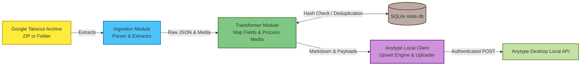
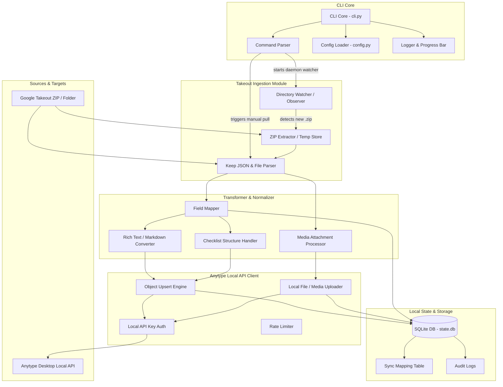

# anykeep project structure   
# the data flow   
the pipeline for how data will travel throughout the code:   


the breakdown of the above diagram:   
- **Phase 1: Ingestion:** Data originates from a Google Takeout ZIP or target folder. The system's ingestion module extracts the archive and parses the raw JSON files and media links.   
- **Phase 2: Transformation:** The parsed raw data is passed into the Transformer Module, which handles mapping the fields, structuring checklists, processing attachments, and converting text to markdown.   
- **Phase 3: State Check:** During transformation, the system cross-references the data with your local SQLite database ( `state.db`). This ensures deduplication so that only new or updated notes proceed further down the pipeline.   
- **Phase 4: Push Preparation:** Validated data is compiled into JSON payloads by the Anytype Local Client, leveraging the Object Upsert Engine and Local File Uploader.   
- **Phase 5: Destination:** Finally, the client uses your stored API key to authenticate and push the data directly into your Anytype Desktop Local API.   
   
# import strategy   
currently with the anytype api, there are two practical means of importing data   
- markdown   
- json   
   
> will be going with json as it helps us to correctly map keep properties to anytype object types    

# the skeleton of anykeep   
code will be written in python!   
## the system overview   


## file structure is as follows:   
```
anykeep/
├── config.yaml.example       # Sample configuration file
├── requirements.txt          # Python dependencies (click, watchdog, sqlite3, requests, etc.)
├── state.db                  # Local SQLite database (auto-generated)
├── src/
│   ├── __init__.py
│   ├── cli.py                # Command-line interface entry point (commands: pull, watch, sync, status)
│   ├── config.py             # YAML loader & Anytype API key retrieval from OS Keyring
│   ├── db.py                 # SQLite database manager for tracking sync_map and hashes
│   ├── takeout_watcher.py    # Directory observer (watchdog) for auto-extracting Takeout ZIPs
│   ├── keep_parser.py        # Parses raw Takeout JSON, HTML, annotations, and media links
│   ├── transformer.py        # Converts Keep JSON objects into Anytype Markdown/JSON payloads
│   └── anytype_client.py     # Communicates with Anytype's Local REST API (localhost)
├── tests/
│   ├── test_parser.py        # Unit tests ensuring Keep JSON and media links are extracted correctly
│   └── test_transformer.py   # Unit tests verifying the accurate conversion to Anytype payloads
└── README.md                 # Project documentation, setup guide, and CLI command reference
```
## database schema   
> below is the database schema that will be used to track hashed files    

```SQL
CREATE TABLE IF NOT EXISTS sync_map (
    keep_file_id TEXT PRIMARY KEY,    -- Keep Note filename or internal ID
    file_hash TEXT NOT NULL,          -- SHA256 of the JSON content to detect updates
    anytype_object_id TEXT,           -- Returned object ID from Anytype Local API
    sync_status TEXT NOT NULL,        -- 'PENDING', 'PARSED', 'PUSHED', 'ERROR'
    media_count INTEGER DEFAULT 0,    -- Tracks the number of attachments (images/audio) associated with the note
    last_synced_at TIMESTAMP DEFAULT CURRENT_TIMESTAMP, -- Timestamps the exact moment of the last sync attempt
    error_message TEXT                -- Stores specific failure details if sync_status is 'ERROR' to help with retries
);
```
# features and capabilities:   
**1. Ingestion & Watch Capabilities**   
- Manual Import ( **`anykeep pull --source`):** Ingests an extracted Google Takeout `Keep/` directory or a `.zip` archive directly.   
- Background Directory Watcher ( **`anykeep watch`):** Continuously runs in the background using the `watchdog` library to observe `~/Downloads` (or any configured folder). When a new Takeout file is detected, it automatically extracts, processes, pushes, and cleans up the archive.   
- **File & Image Extraction:** Reliably extracts drawing attachments, JPEG/PNG images, and audio attachments provided in the Takeout export without needing third-party stream downloads.   
   
**2. Anytype Integration & Security**   
- **Anytype Local API Key Authentication:** Reads the local Anytype Desktop API key stored safely in the OS Keyring ( `keyring` package) or via environment variables.   
- **Zero External Cloud Auth:** Completely eliminates Google OAuth apps, Client Secrets, Master Tokens, and Google Cloud Console setup.   
   
**3. State Tracking, Deduplication & Reliability**   
- SQLite Idempotency Database ( **`state.db`):** Tracks note file checksums (SHA256) and maps Keep IDs to Anytype Object IDs to maintain sync state.   
- **Deduplication:** Re-importing a Takeout archive will only process and push newly created or updated notes.   
- **Per-Note Error Audit Logging:** Any failed payload transformations or media upload failures are recorded in `state.db` with an `ERROR` state for safe, targeted retries.   
   
## configuration and UX   
### yaml config file   
> since the program doesn't interact with any sensitive use data (other than their takeout exports) the config file will only contain local environment variables   

the basic structure will be as follows:   
```yaml
# ~/.config/anykeep/config.yaml

anytype:
  host: "127.0.0.1"               # Default Anytype Local API host
  port: 3100                      # Default Anytype Local API port
  target_space_id: "SPACE_ID"     # The specific Anytype space to push notes into

ingestion:
  watch_directory: "~/Downloads"  # Folder for 'anykeep watch' to monitor
  auto_delete_zip: true           # If true, deletes the Takeout .zip after successful sync

storage:
  db_path: "~/.config/anykeep/state.db" # Where the SQLite state tracking lives
  log_level: "INFO"               # CLI verbosity (INFO, DEBUG, ERROR)
```
note on the Anytype API key: Local API key is intentionally omitted from this file. It will be securely stored in the OS Keyring during the initial CLI setup.   
### cli and non-interactive modes   
1. anykeep auth (Setup)   
    Since Google auth is completely eliminated, this command's sole purpose is to securely capture your Anytype Local API Key and store it in your operating system's credential vault.   
    - **Command:** `anykeep auth --set-key`   
    - **Action:** Prompts you to paste your Anytype API key securely (hidden input). It saves the key to the OS Keyring so `anytype\_client.py` can retrieve it silently on future runs.   
2. anykeep pull (Manual Import)    
    This is your standard command for one-off ingesting.   
    - **Command:** `anykeep pull --source <path>`   
    - **Example:** `anykeep pull --source ~/Downloads/takeout-20260819T170000Z-001.zip`   
    - **Action:** Ingests the specified `.zip` archive or extracted `Keep/` directory directly. It extracts the contents, hashes the JSON files, compares them against `state.db` to prevent duplicates, and pushes any new/updated notes and media attachments into Anytype.   
3. anykeep watch (Background Automation)    
    This replaces the concept of a scheduled API polling daemon.   
    - **Command:** `anykeep watch`   
    - **Action:** Starts a background process using the `watchdog` library to continuously monitor your configured `watch\_directory` (e.g., `~/Downloads`). The moment you download a new Takeout `.zip` from Google, this command automatically detects it, runs the extraction and push pipeline, and cleans up the archive.   
4. anykeep status (Audit & Review)    
    Provides a visual overview of your sync state based on the local SQLite database.   
    - **Command:** `anykeep status`   
    - **Action:** Displays a clean CLI summary table. It will show metrics such as:   
        - Total notes synced   
        - Total media files uploaded   
        - Pending or unpushed items   
        - A list of `ERROR` states with specific IDs if any files failed to parse or upload properly.   
   
# what the mvp looks like in phases   
**Phase 1: CLI Core & Local Ingestion**   
- Build YAML/Config handling ( `src/config.py`) and the Anytype Local API Key loader.   
- Implement `keep\_parser.py` to handle standard Takeout JSON formats (extracting title, text content, labels, timestamps, checklist states).   
- Set up the `state.db` SQLite schema.   
   
**Phase 2: Anytype Object Transformation & Push**   
- Implement `transformer.py` to translate Keep JSON to Anytype schema objects.   
- Build `anytype\_client.py` targeting Anytype's Local REST API endpoints ( `POST /v1/spaces/:space\_id/objects` and `POST /v1/spaces/:space\_id/files`).   
- Connect the full pipeline for the `anykeep pull` command.   
   
**Phase 3: Directory Watcher & Automation**   
- Implement `takeout\_watcher.py` using `watchdog` to monitor target folders for newly downloaded Takeout ZIPs.   
- Add automatic archive unzipping, processing, and post-sync cleanup.   
- Provide system service templates (systemd / launchd) to run `anykeep watch` in the background.   
   
**Phase 4: Status Dashboard & Polish**   
- Add the `anykeep status` command to display a CLI summary table of synced notes, unpushed items, and media counts.   
- Add tag/label mapping rules to accurately map Google Keep labels into Anytype tags.   
